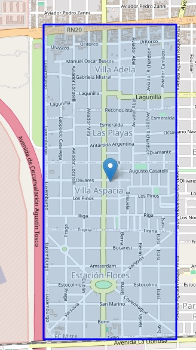
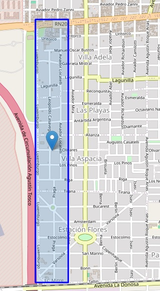
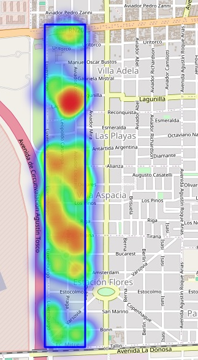
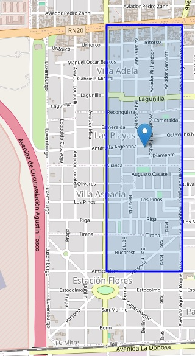
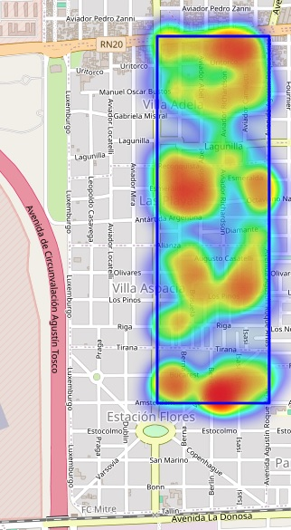
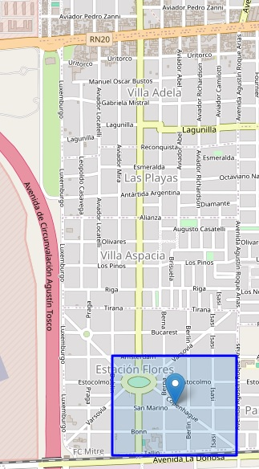
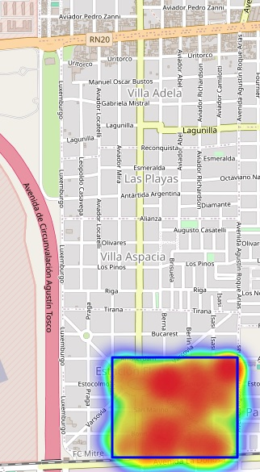

# Criminal Investigation Summary - Public Safety

It is important to clarify that, for legal reasons, the data has been altered. Although the geographic area is real, the data has been modified to:

1. Reflect the issues of the area without including exact locations or precise dates.
2. Omit the first part of the ETL, where sensitive data of complainants, witnesses, residential addresses, IDs, and other confidential data is still included.
3. Although specific data references are no longer made, the applied strategies are excluded as they involve sensitive data necessary for the corresponding metrics.

## Project Objective

To faithfully reflect the real investigation (in which I participated, leading all steps including post-application follow-up) to provide a clear insight into:

1. The process.
2. The involved actors.
3. The analysis conducted.
4. The necessary approach to interpret this type of data.
5. What to report to the interdisciplinary board and the general public.

Additionally, other elements that, without revealing specific details of the criminal investigation, constitute the rest of the project and a proposal to combat crime in a specific area, with evidence of its effectiveness in reality.

## Complete quadrant where the investigation was conducted:

The quadrant has 3 sectors where crime is significantly clear. Outside of these sectors, there are areas that do not really reflect a serious problem compared to the average crime rate. Furthermore, these 3 sectors have very specific characteristics, both in terms of economic activity and criminal activity.

## Quadrant division based on its economic activity:

### Sector I (Industrial)

This sector is completely filled with factories, warehouses, or large stores of construction products or machinery. It is an area practically without private residences, where crimes are concentrated in three main areas:

- Vandalism
- Theft
- Robbery

It was difficult to identify the issue purely from the data aspect, as, as we can see, the distribution (a replica of the real situation) of the events does not present a specific focus.

This complexity is repeated in all three sectors, which is why the approach required a deep understanding of "crime" as an entity in itself and the correct interpretation of the data. Thanks to this, it was possible to decipher how vandalism was the gateway for other crimes, as it served as a "vanguard" function, seeking to identify the establishment's security measures and the emergency response.

### Sector II (Residential)

The complexity of this sector lies in the fact that, although it is a purely residential area, the integration of the residents did not occur spontaneously, which is necessary for proper integration. Several peripheral neighborhoods of the city, already with conflicts among them, were inserted over a neighborhood with its own ecosystem, thus fostering crimes such as:

- Robbery
- Vehicle theft
- Minor injuries
- Serious injuries
- Theft

While robbery, theft, and vehicle theft occur due to the concentration of "offer" due to the large number of people living in the area, injuries mostly occurred due to conflicts between neighbors, many of which stemmed from robberies and thefts among neighbors. We could say it was a negatively self-reinforcing cycle. Of course, not all incidents followed this pattern, but the vast majority did, reaching peaks where, if we observe the charts in , they coincide by occurring in a relatively short timeframe.

This made traditional tools from emergency systems useless to combat this situation, forcing me to adopt a very different strategy (this with all the challenges it entails due to lack of knowledge in that field and the lack of understanding of the necessary elements to evaluate or elements to consider based on the application process), strategies of "social cohesion," developing positive dynamics among the neighbors (meetings, sports events, training sessions, national celebrations, etc.), thus seeking to reshape the social fabric of the area through common interests.

### Sector III (Commercial)

A sector with high pedestrian and vehicle traffic, where commercial activities are concentrated, as well as schools (kindergartens, primary, and secondary schools), public transport stops, and a plaza that functions as a neuralgic center. At night, the pedestrian traffic does not decrease, which fosters incidents such as:

- Robbery
- Piraña robbery
- Armed robbery

What stands out and is also the challenge of the sector was the search for quick and effective hits by criminals. Hence the use of weapons or large numbers of people to cover more victims (groups of students, groups of people waiting for public transport, etc.) in the shortest time possible and taking advantage of the traffic dynamics to leave the area.

This required, contrary to the previous point, a more reactive approach, with security rings arranged to activate when an incident occurs, up to a patrolling circuit that accompanies and monitors pedestrian groups, personal accompaniment of each business in the area, thus avoiding the possibility of events outside the safe dynamics of the premises (businesses closing late, security breaches due to accidental events, etc.).

### Clarification:

The first stage of data cleaning was left out, as the data or variables excluded were the personal and identification data of the participants in the interviews. Thus, it goes directly to the use of the heatmap based on the number of events, to understand what to observe in this type of investigations.

Locations will not match dates, thus avoiding references to possible ongoing investigations, focusing on the vision or approach to address these studies. The criminal investigation process is also left out as it reveals the investigators' tools along with the specific details of the strategies.